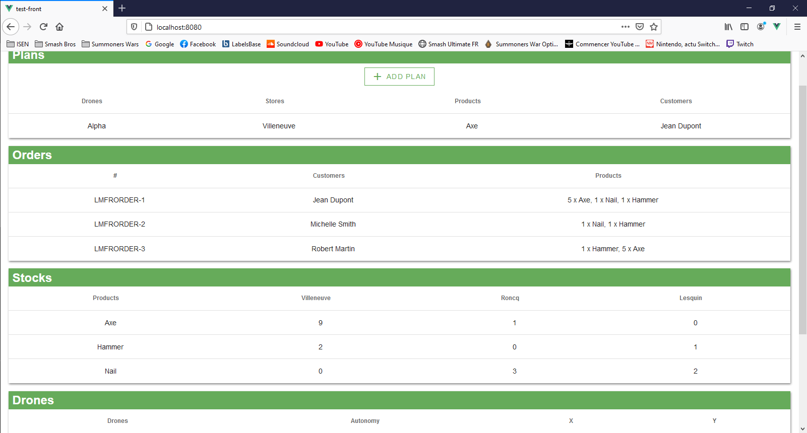
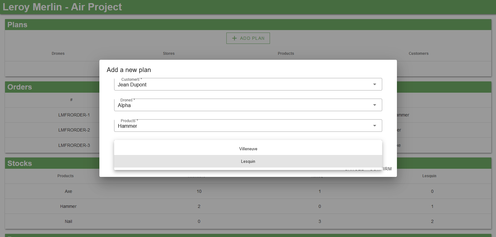

# Air Project



*Air Project est une interface graphique Web permettant  de planifier des vols des drones pour livrer les Habitants (Test de code Leroy Merlin)*

## Project setup
Après avoir Pull le projet, executer la commande suivante dans un terminal : 
```
npm install
```

## Demarrage de l'interface graphique
Pour demarrer l'interface graphique, executer la commande suivante dans un terminal :
```
npm run serve
```
L'interface sera accessible au lien *http://localhost:8080* (pour un lancement en local)

## Explication de Air Project
### Utilisation
L’interface permet de visualiser :
- La liste des commandes (identifiant, nom de l’Habitant, les produits commandés
- La liste des drones (identifiant, autonomie, position X, position Y)
- L’état des stocks des magasins
- Les plans de vols créés

Les données liées aux drones (leur autonomie) et liées aux stocks en magasin, sont mises à jour en fonction de la création de plans de vol.

Enfin, l'application permet la mise en place de plan de vols de drones. 



L'utilisateur pourra donc paramétrer : 
- Le client à livrer
- Le drone missioné pour la livraison
- Le produit à livrer
- Le magasin fournissant le produit
